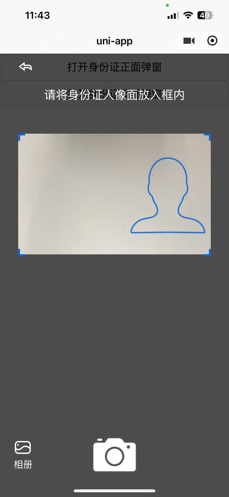
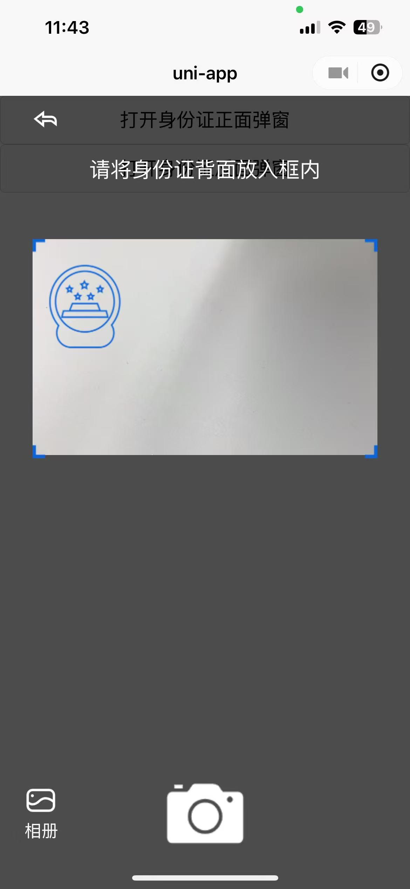
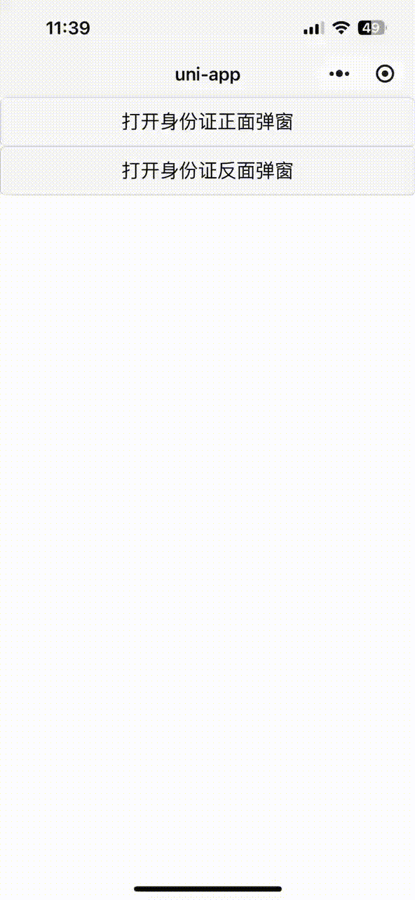

# Idcard-Camera-Popup 

uniapp 身份证拍照组件，使用了微信小程序 API ，目前仅支持微信小程序。

| 平台 | 支持情况 |
| --- | --- |
| 微信小程序 | ✅ |

## Demo

  


## Usage

1. 将 `\uni_modules\` 下的 `jh-idcard-camera` 文件夹放入您 uniapp 项目文件夹下的 `\uni_modules\` 目录内。
2. 参照本项目 `/pages/index.vue` 文件使用，直接在页面内使用组件 `<jh-idcard-camera ref="cameraPopup" />`。

```
<template>
	<view>
    <button @click="openFront">打开身份证正面弹窗</button>
    <button @click="openSide">打开身份证反面弹窗</button>
    <jh-idcard-camera ref="cameraPopup" @get-photo="getPhoto" />
	</view>
</template>

<script setup>
  import { ref } from "vue";

  const cameraPopup = ref();
  
  const openFront = () => {
    cameraPopup.value?.open('front');
  }
  
  const openSide = () => {
    cameraPopup.value?.open('side');
  }

  const getPhoto = (data) => {
    const { type, base64, url } = data;
    console.log('正反面类型', type);
    console.log('图片base64', base64);
    console.log('储存在微信本地的临时地址', url);
  }
  
</script>
```
